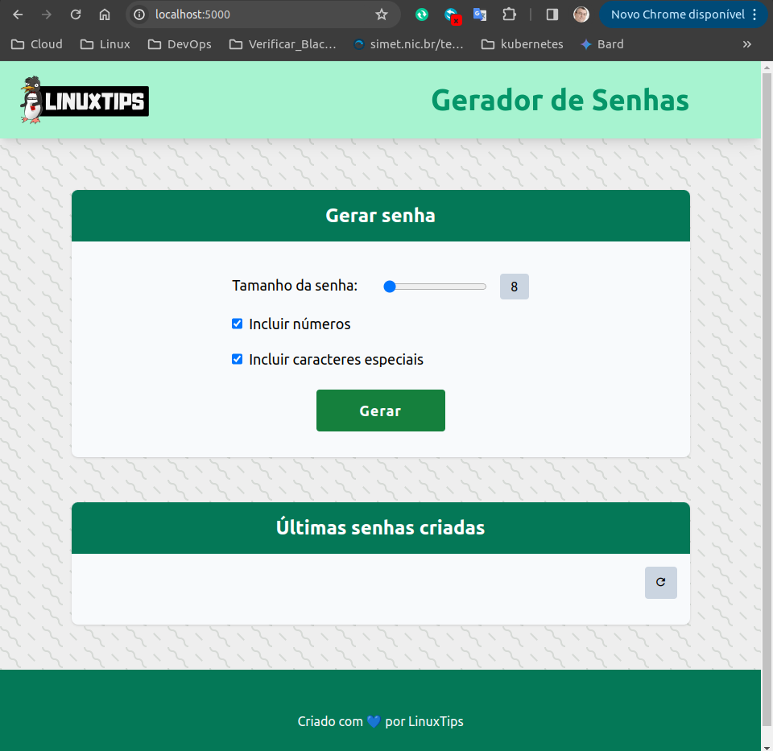

## DESAFIO DO DIA 2

Agora que você já sabe como colocar a App para rodar, você precisa coloca-la em uma imagem de container! E para isso, você precisa criar um DockerFile e lá, adicionar todos os detalhes necessários!

Nessa atividade você não tem o passo a passo de como criar cada tarefa, afinal, aqui é um desafio! Hora de você estudar, se dedicar e concluir esse desafio!

Esse não é um teste fácil, então tenha paciência com você!

### Descrição

1. Criar um conta no Docker Hub, caso ainda não possua uma.  
2. Criar uma conta no Github, caso ainda não possua uma.  
3. Criar um Dockerfile para criar uma imagem de container para a nossa App  
        O nome da imagem deve ser SEU_USUARIO_NO_DOCKER_HUB/linuxtips-giropops-senhas:1.0  
4. Fazer o push da imagem para o Docker Hub, essa imagem deve ser pública  
5. Criar um repo no Github chamado LINUXtips-Giropops-Senhas, esse repo deve ser público.  
6. Fazer o push do cógido da App e o Dockerfile.
7. Criar um container utilizando a imagem criada.  
    O nome do container deve ser giropops-senhas  
    Você precisa deixar o container rodando  
8.  O Redis precisa ser um container  

> [!TIP]  
Preste atenção no uso de variável de ambiente, precisamos ter a variável REDIS_HOST no container. Use sua criatividade!

## Passos

Com as contas do Docker Hub e GitHub criadas vamos a execução.

### Criando os Dockerfiles

1. "Dockerfile.app" da aplicação giropops-senha
```
FROM python:3.13.0a4-alpine3.19

LABEL description="Desafio day2" \
      stack="Python" \
      version="3.13.0a4-alpine3.19"

RUN mkdir -p /usr/src/app
WORKDIR /usr/src/app

COPY requirements.txt /usr/src/app/
RUN pip install --no-cache-dir -r requirements.txt && pip install werkzeug===2.2.2

COPY app.py .
COPY templates/ templates/
COPY static/ static/

EXPOSE 5000

ENV REDIS_HOST="redis-server"

ENTRYPOINT ["flask", "run", "--host=0.0.0.0"]
```  
- Vamos gerar a imagem da aplicação com o comando "docker Build"  

```
docker build -t israeldoamaral/linuxtips-giropops-senhas:1.0 -f Dockerfile.app .
```

2. "Dockerfile.redis" do banco Redis

```
FROM redis:7.2.4

LABEL description="Desafio Day2" \
      stack="Redis" \
      version="7.2.4"

EXPOSE 6379

ENTRYPOINT [ "redis-server" ]
```

- Vamos gerar a imagem do Redis com o comando "docker Build"  
```
docker build -t israeldoamaral/redis-server -f Dockerfile.redis .
```  

### Push das imagens para o Docker Hub  

1. push da imagem da aplicação  

```
docker push israeldoamaral/linuxtips-giropops-senhas:1.0
```  

2. push da imagem do Redis  

```
docker push israeldoamaral/redis-server
```  

## Rodando os containers  

```
docker network create app_network  
docker run -d --name redis-server --network app_network israeldoamaral/redis-server  
docker run -it -p 5000:5000 --network app_network --name app israeldoamaral/linuxtips-giropops-senhas:1.0
```

