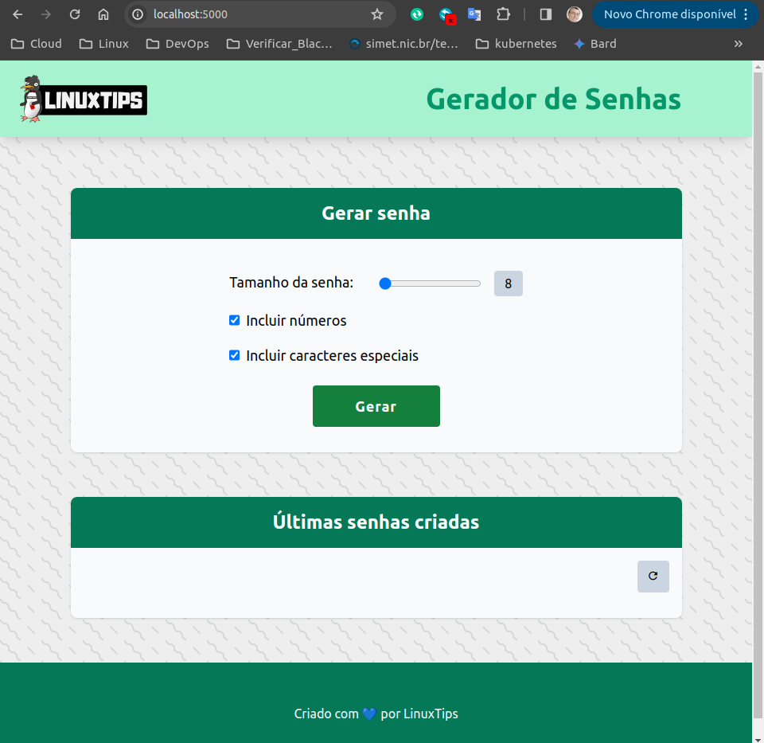

## DESAFIO DO DIA 3

### Descrição

1. Criar as imagens da aplicação e Redis usando como base as Distroless da chainguard. deixando-as com tamanho reduzido e com pouca ou sem vulnerabilidades.  
2. Usar o metodo Multistage Build.  
3. Verificar as vunerabilidades das imagens com o **Trivy**
4. Assinar as imagens utilizando o **Cosing**
  

## Faça o Fork da aplicação
```
https://github.com/badtuxx/giropops-senhas
```

### Criando os Dockerfiles

1. "Dockerfile.app"
```
FROM cgr.dev/chainguard/python:latest-dev as builder

WORKDIR /app

COPY requirements.txt .

RUN pip install --no-cache-dir -r requirements.txt --user


FROM cgr.dev/chainguard/python:latest

WORKDIR /app

COPY --from=builder /home/nonroot/.local/lib/python3.12/site-packages /home/nonroot/.local/lib/python3.12/site-packages
COPY --from=builder /home/nonroot/.local/bin  /home/nonroot/.local/bin
ENV PATH=$PATH:/home/nonroot/.local/bin

COPY app.py .
COPY static/ static/
COPY templates/ templates/

ENV REDIS_HOST="redis-server"

ENTRYPOINT ["flask", "run", "--host=0.0.0.0"]
```  
- Vamos gerar a imagem da aplicação com o comando "docker Build"  

```
docker build -t israeldoamaral/linuxtips-giropops-senhas:1.0 -f Dockerfile.app .
```

2. "Dockerfile.redis"

```
FROM  cgr.dev/chainguard/redis 


LABEL description="Desafio Day3" \
      stack="Redis" \
      version="7.2.4"

EXPOSE 6379

ENTRYPOINT [ "redis-server" ]
```

- Vamos gerar a imagem do Redis com o comando "docker Build"  
```
docker build -t israeldoamaral/redis-server -f Dockerfile.redis .
```  

## Verificando as vulnerabilidades das imagens
> [!NOTE]
Para verificar as vulnerabilidades nas imagens vamos utilizar o [**Trivy**](https://aquasecurity.github.io/trivy/v0.18.3/)<p>
Trivy é um scanner de vulnerabilidade simples e abrangente para contêineres e outros artefatos.

```
$ trivy image israeldoamaral/linuxtips-giropops-senhas:1.0
```


```
$ trivy image israeldoamaral/redis-server
```


## Push das imagens para o Docker Hub  
Com as imagens verificadas e sem vulnerabilidades, vamos fazer o Push das imagens **linuxtips-giropops-senhas:1.0** e **redis-server** para o repositório no DockerHub

1. push da imagem da aplicação  

```
docker login
docker push israeldoamaral/linuxtips-giropops-senhas:1.0
```  

2. push da imagem do Redis  

```
docker push israeldoamaral/redis-server
```  

## Assinando as imagens com o cosign
> [!NOTE]
O Cosign é uma ferramenta de assinatura e verificação de contêineres open-source desenvolvida pela [**Sigstore**](https://docs.sigstore.dev/). Sigstore é uma comunidade de código aberto que se concentra em fornecer ferramentas e práticas recomendadas para melhorar a transparência e a segurança do software. O objetivo principal do Cosign é permitir que os desenvolvedores assinem digitalmente imagens de contêineres para garantir sua autenticidade e integridade.

> [!WARNING]
As imagens devem estar presente no registry(público ou privado), neste caso, no DockerHub para permitir a assinatura e verificação.

### Gerando as chaves
```
cosign generate-key-pair --output-key-prefix giropops-senha
cosign generate-key-pair --output-key-prefix redis-server
```
### Assinando as imagens
```
cosign sign --key giropops-senha.key israeldoamaral/linuxtips-giropops-senhas:1.0 
cosign sign --key redis-server.key israeldoamaral/redis-server
```
### Validando a assinatura
```
cosign verify --key giropops-senha.pub israeldoamaral/linuxtips-giropops-senhas:1.0
cosign verify --key redis-server.pub israeldoamaral/redis-server:latest
```

## Rodando os containers  

```
docker network create app_network  
docker run -d --name redis-server --network app_network israeldoamaral/redis-server  
docker run -it -p 5000:5000 --network app_network --name app israeldoamaral/linuxtips-giropops-senhas:1.0
```

